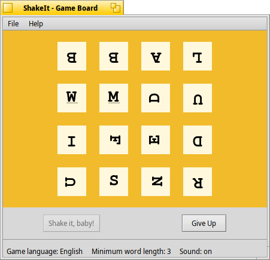

# ShakeIt

A word searching game for Haiku inspired by Boggle(tm).

## Prerequisites
ShakeIt should compile and run under any version of Haiku that is not too ancient. 
A C++11 capable compiler is required, so remember to do a *setarch x86* on 32bit Haiku. 

The development packages of the following software is required to compile ShakeIt:
- boost
- sqlite3
- tinyxml

## Compiling 
Compiling is done using the makefile engine supplied with Haiku. A simple *make* compiles the code,
and *make bindcatalogs* adds the translations. For now, only English and German are available. 

If you are using ShakeIt for the first time, you have to run *create_userdir.sh* from the **scripts** directory.
It copies the required config and data files to **/boot/home/settings/ShakeIt**.

After that, you can run *ShakeIt* from the generated *objects.xxxxx* directory. 

